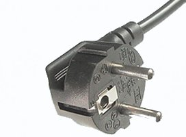
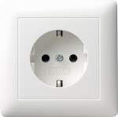

## {{ page.title }}

* TOC
{:toc}

Berlin is the capital of Germany, and one of the most lively cities in Europe.
It is one of the few cities to have three UNESCO World Heritage sites.
In addition to the Museum Island and the Prussian royal palaces and gardens, Berlin's Modernist housing estates received the designation in 2008.
The German capital has also been named a "UNESCO City of Design", making Berlin a part of the UNESCO Creative Cities Network.

Berlin is the only city in the world with three active opera houses.
The Deutsche Oper, the Staatsoper on Unter den Linden and the Komische Oper together can welcome more than 4,800 people to their performances.
Berlin also has around 150 theatres and stages offering performances in all genres.

And most importantly, Berlin is the only European city that has more museums than rainy days ;).

Below you find more information about sightseeing, transportation options, and other important travel tips.

## Sightseeing

TBA

## Transportation

### International Flight Connections

Travelling to Berlin is convenient. Berlin is connected via two international airports, <a href="http://www.berlin-airport.de/en/travellers-txl/index.php">Tegel Airport</a> and <a href="http://www.berlin-airport.de/en/travellers-sxf/index.php">Sch&ouml;nefeld Airport</a>.
If you have a choice, you should choose Tegel as this airport is closer located to the venue.

Several airlines operate direct intercontinental flights from the following cities: New York/JFK, Newark (Air Berlin, Lufthansa, United Airlines), Chicago (Air Berlin), Miami (Air Berlin), and Peking (Hainan Airlines).
Furthermore, multiple flights from major European hubs are available per day, such as London (~1.50 hours), Amsterdam (1.15 hours), and Paris (1.40 hours).

Alternatively, ICN participants can fly to Munich airport or Frankfurt airport, which are both reachable from Berlin in approx. 1 hour.

### Train Connections

The German railway system is mainly operated by <a href="http://www.bahn.de/i/view/USA/en/index.shtml">Deutsche Bahn</a>.
If you arrive via train, you should target S&uuml;dkreuz, which is the closest larger railway station with respect to the venue.

### Public Transport

The public transport includes metro (U-Bahn), local trains (S-Bahn), bus, and tram.
Each ticket is valid for all four transportation options.
Fees are organized according to three zones.
If you stay in the inner city, which is almost everything except Sch&ouml;nefeld airport, you need an "AB" ticket.
From Sch&ouml;nefeld airport, you need an ABC ticket.
A single AB ticket with a two-hour validity costs 2,70 EUR, a day ticket 7,00 EUR, and a 7-day pass 30,00 EUR.
Do not miss to stamp your ticket <i>before</i> you use it.
For further information and to plan a journey have a look at <a href="http://www.bvg.de/index.php/en/index.html">BVG</a>, the main operator of the public transport.

## Weather

September is late summer in Berlin.
Temperatures usually range between 20 &#8451; over the day and 15 &#8451; durin the evening.
Rain is rather unlikely, however, we suggest not to forget an umbrella.

## Electricity

  > Voltage: 230 V  
  > Frequency: 50 Hz  
  > Power sockets: type F

