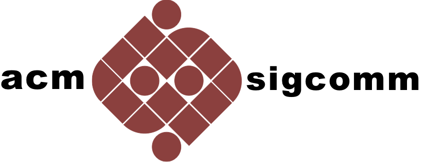

<!-- {{ site.data.test }} -->

## Welcome to ACM ICN 2017

The organizing committee is delighted to invite you to ACM ICN 2017, to be held in Berlin, Germany in September 26-28, 2017.

The fundamental concept in Information-Centric Networking (ICN) is to provide accessing named data as a principal network service, evolving the Internet from today's host based packet delivery towards directly retrieving information objects by names in a secure, reliable, scalable, and efficient way. These architectural design efforts aim to directly address the challenges that arise from the increasing demands for highly scalable content distribution, from accelerated growths of mobile devices, from wide deployment of Internet-of-things (IoT), and from the need to secure the global Internet. {{ site.title }} will be a single track conference focusing on current ICN research topics, featuring paper presentations and demonstrations.

This year's keynote will be given by [Jon Crowcroft](https://www.cl.cam.ac.uk/~jac22), Marconi Professor of Communications Systems at University of Cambridge, and distinguished
expert in Communications, Multimedia, and Social Systems.

 
  <!--<a href="http://127.0.0.1:4000/acm-icn/2017/registration.html" target="_blank" data-role="button" class="button">Online registration coming soon</a>-->
  <a href="registration.html" data-role="button" class="button">Registration</a>

## News

<!-- Stay tuned! -->



<!-- ## Conference Schedule

TBD. -->

<!-- 

 -->

<!-- ## Calendar -->



<iframe src="https://calendar.google.com/calendar/embed?title=ACM%20ICN%20Agenda&amp;showTitle=0&amp;showPrint=0&amp;showCalendars=0&amp;mode=AGENDA&amp;height=600&amp;wkst=1&amp;hl=en&amp;bgcolor=%23ffffff&amp;src=fgkdoih822v80dfk304pt56fjo%40group.calendar.google.com&amp;color=%23125A12&amp;ctz=America%2FSao_Paulo" style="border-width:0" width="100%" height="400" frameborder="0" scrolling="no"></iframe>



<!-- ## Important Dates

TBD. -->

<!--  -->

## Important Dates



## Sponsors

	
	

**Technically Co-Sponsored**

	

