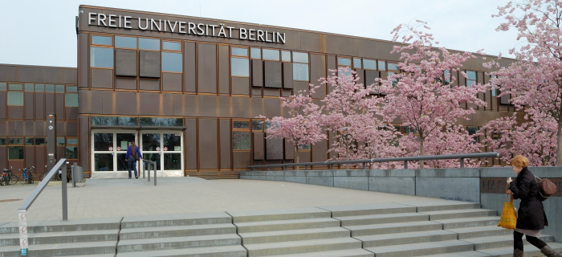
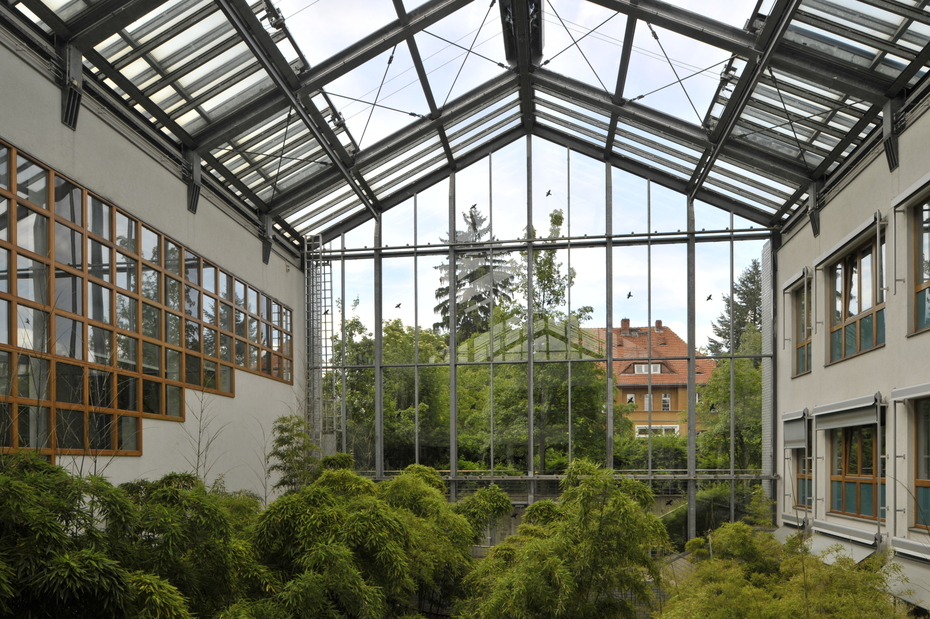
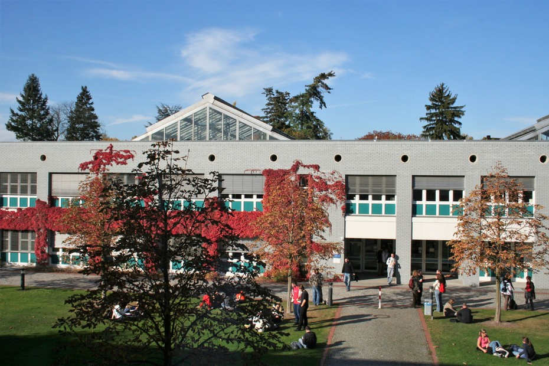
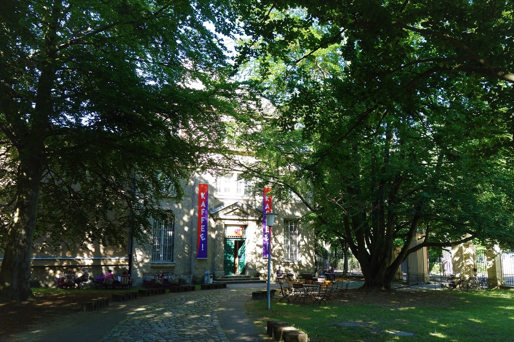
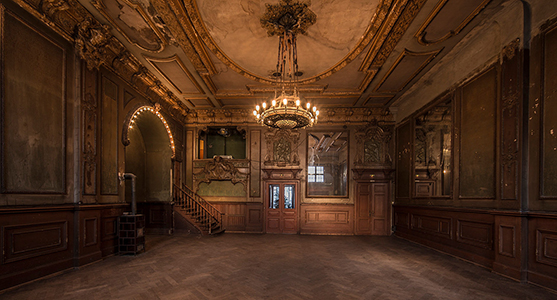
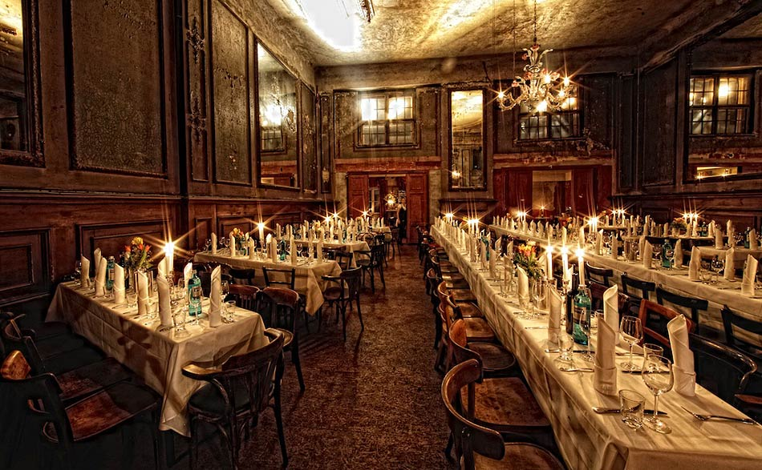
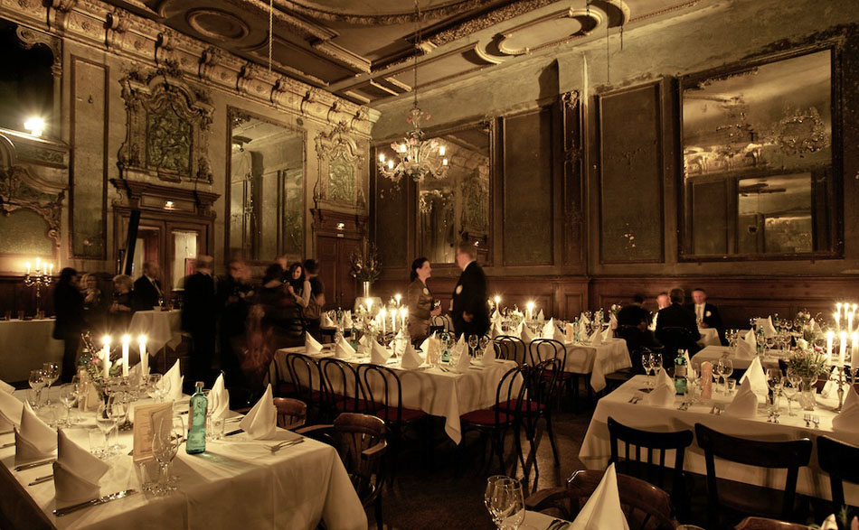

## {{ page.title }}

* TOC
{:toc}

{{ site.title }} takes place at Freie Universit&auml;t Berlin, Germany.
FU Berlin is located in the south of Berlin.
Even located in the quiet area of Berlin, FU Berlin is perfectly connected via public transport to all major touristic attractions in Berlin, which might be an option before or after the conference.
Some attractions are even in walking distance, such as the Botanical Garden or the Ethnological Museum.

We will meet at the Institute of Computer Science, which is part of the Dahlem Campus.
Dahlem has the reputation of an idyllic and quiet area. Several smaller parks and green areas are in walking distance, which will provide an inspiring atmosphere for {{ site.title }}.

## Getting to Conference Venue

**Venue address:**

  > Freie Universit&auml;t Berlin  
  > Computer Science  
  > Takustr. 9  
  > 14195 Berlin, Germany

Note that the CS building is not directly visible from access roads.
You can download  [the offline CS campus map](http://www.mi.fu-berlin.de/fb/contact/bild_mathinf-lageplan-300dpi/mathinf-lageplan-300dpi.jpg?width=930). ACM ICN is located in building 9.

Details will follow.

## Social Events

### Welcome Reception, September 26
The welcome reception of ACM ICN 2017 will take place at Museum Europ&auml;ischer Kulturen (<i>Museum of European Cultures</i>, or short MEK). The event is located in 5 minutes walking distance of the conference venue.

The main objective of MEK is collecting, researching, preserving, and presenting artefacts of common European culture, starting in the 18th century until today.
The museum continually seeks to forge connections between the historical collection and current issues.

The welcome reception will allow ACM ICN participants to visit the exhibition of the museum (do not forget your badge).
Depending on the weather conditions, food and drinks will be served inside or outside in the garden.

**Venue address:**

  > MEK -- Museum Europ&auml;ischer Kulturen  
  > Arnimallee 25  
  > 14195 Berlin | Germany  

  > [Homepage](http://www.smb.museum/en/museums-institutions/museum-europaeischer-kulturen/home.html)

### Guided city tour to the banquet, September 27

To make the ride to the banquet more interesting, we organize a guided city tour to the venue of the banquet.
We will meet at the local train station Friedrichstr., split in groups of 30 people, and then walk to the banquet (45-60 minutes).
The tour is organized by professional tour guides, explaining you all details about the historic neighborhood and giving you insights outside of the common tourist paths.

More details will follow.

### Banquet, September 27

The banquet of ACM ICN 2017 will take plaec at a historic venue, the Spiegelsaal (<i>mirrored ballroom</i>) of Cl&auml;rchens Ballhaus.
The event is located in the east city center of Berlin.

The building opened its doors for the public on September 13th, 1913.
There are a veritable host of stories around this place.
It is mentioned in the famous novel <i>Berlin Alexanderplatz</i> by Alfred D&ouml;blin.
The German illustrator and photographer Heinrich Zille had his regular place at the bar, where he used to sit and draw.
Otto Dix painted the poster for the place (1931), which is still used today.

After WWII, the mirrored ballroom remained closed.
It was reopened in January 2005.
All interior was left largely untouched.

**Venue address:**

  > Spiegelsaal, Cl&auml;rchens Ballhaus  
  > Auguststrasse 24  
  > 10117 Berlin | Germany  

  > [Homepage](https://www.spiegelsaal-berlin.de/)

More details will follow.
